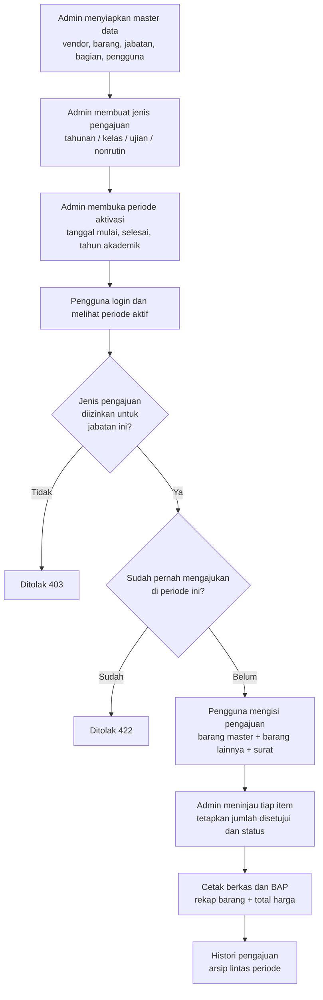

# UNIKOM Perlengkapan — Backend v2

REST API untuk pengelolaan pengajuan perlengkapan ATK di lingkungan Universitas Komputer Indonesia. Aplikasi ini menggantikan sistem lama dan menangani seluruh siklus: pembukaan periode pengajuan oleh admin, pengajuan barang oleh unit kerja, persetujuan per item, sampai pencetakan berkas dan rekap histori.

Frontend-nya terpisah dan mengonsumsi API ini; produksi berjalan di `logistikatk.unikom.ac.id`.

## Teknologi

| Komponen | Keterangan |
| --- | --- |
| Framework | Laravel 13 (PHP 8.2+) |
| Autentikasi | Laravel Sanctum (bearer token) |
| Basis data | MySQL |
| Dokumentasi API | L5-Swagger, sumber di `docs/` |
| Deploy | GitHub Actions via SSH, terpicu dari push ke `dev` |

## Alur Proses Kerja

Inti aplikasi ini adalah satu siklus pengajuan yang berulang setiap periode akademik. Selama tidak ada **periode aktif**, pengguna tidak bisa mengajukan apa pun — jadi langkah admin di awal adalah pintu masuk seluruh proses.



### 1. Penyiapan master data

Admin mengelola data acuan yang dipakai seluruh proses: **vendor**, **barang** (nama, kategori, tipe, satuan, harga, vendor), **jabatan**, dan **bagian/unit**. Data pengguna bisa diisi manual atau ditarik dari API kepegawaian UNIKOM lewat `POST /api/users/sync`.

Kategori barang terbagi tiga — `atk_tahunan`, `atk_ujian`, `atk_kelas` — dan tipenya `habis_pakai` atau `tidak_habis_pakai`.

### 2. Pembuatan jenis pengajuan

Tabel `pengajuan` menyimpan *jenis* pengajuan, bukan pengajuan milik pengguna. Satu baris menggambarkan kombinasi:

- **tipe**: `tahunan`, `kelas`, `ujian`, atau `nonrutin`
- **semester**: `ganjil`, `genap`, atau `tahunan`
- **ujian**: `uts`, `uas`, atau `Default`

### 3. Pembukaan periode aktivasi

Sebuah jenis pengajuan baru bisa dipakai setelah admin membuka periodenya di `aktivasi_pengajuan`, lengkap dengan `aktif_mulai`, `aktif_selesai`, `tahun_akademik`, dan tipe `rutin` atau `nonrutin`. Di luar rentang tanggal itu pengajuan ditolak.

Pengguna memeriksa periode yang sedang berjalan lewat `GET /api/periode-aktif`.

### 4. Pengajuan oleh pengguna

Pengguna login dan mengirim pengajuan lengkap ke `POST /api/daftar-pengajuan/full`. Satu pengajuan memuat dua jenis item:

- **Barang master** — dipilih dari daftar barang yang sudah ada, hanya yang jumlahnya lebih dari nol yang disimpan.
- **Barang lainnya** — barang di luar master, wajib menyertakan nama, satuan, kategori, alasan, dan boleh dilampiri bukti foto. Item ini otomatis diarahkan ke vendor internal bernama `Perlengkapan`.

Pengajuan juga bisa melampirkan berkas **surat pengajuan**.

Ada tiga aturan yang dijaga di titik ini:

1. **Kewenangan jabatan.** Jabatan yang mengandung kata *dekan* atau *kaprodi* boleh mengajukan tipe `tahunan`, `kelas`, dan `ujian`. Jabatan lain hanya boleh `tahunan`.
2. **Periode harus aktif.** Tanpa aktivasi yang sedang berjalan untuk tipe tersebut, pengajuan ditolak.
3. **Satu pengajuan per periode.** Pengguna yang sudah mengajukan di periode yang sama tidak bisa mengajukan lagi.

Seluruh penyimpanan dibungkus transaksi, sehingga kegagalan di tengah proses tidak meninggalkan pengajuan setengah jadi.

### 5. Peninjauan dan persetujuan

Admin membuka daftar pengajuan yang masuk, lalu menyetujui **per item**, bukan per pengajuan. Setiap item punya `jumlah_disetujui` yang bisa berbeda dari jumlah yang diminta, dan `status` bernilai `0`, `1`, atau `2`.

- Barang master: `PATCH /api/admin/barang-pengajuan/{id}/approve`
- Barang lainnya: `PATCH /api/admin/barang-pengajuan-lainnya/{id}/approve`

### 6. Cetak berkas

Setelah peninjauan selesai, admin merekap hasilnya lewat `GET /api/admin/cetak-berkas` dengan parameter `tahun` dan `id_aktivasi`, serta filter opsional `tipe` dan `kategori_atk`. Keluarannya adalah gabungan seluruh barang dari semua pengajuan pada periode itu beserta harga, subtotal, vendor, dan total keseluruhan — yang kemudian dicetak sebagai BAP.

### 7. Histori

Arsip lintas periode tersedia untuk admin di `GET /api/histori` dengan filter jabatan, bagian, dan aktivasi. Pengguna biasa melihat arsipnya sendiri di `GET /api/histori-pengajuan/my`.

## Peran dan Hak Akses

Autentikasi memakai bearer token Sanctum. Ada dua tingkat akses:

| Peran | Cakupan |
| --- | --- |
| Pengguna | Membuat pengajuan, melihat pengajuan dan histori miliknya sendiri |
| Admin | Seluruh master data, peninjauan dan persetujuan, cetak berkas, histori semua unit |

Endpoint khusus admin berada di balik middleware `admin`; permintaan tanpa token dijawab `401`, dan token non-admin dijawab `403`.

Perlu dicatat: batasan **jabatan** (dekan/kaprodi) terpisah dari **peran** (admin/pengguna). Jabatan menentukan jenis pengajuan yang boleh diajukan, peran menentukan menu yang bisa diakses.

## Struktur Data Inti

```
pengajuan            jenis pengajuan (tipe, semester, ujian)
  └── aktivasi_pengajuan     periode aktif (tanggal, tahun akademik, rutin/nonrutin)
        └── daftar_pengajuan       satu pengajuan milik satu pengguna
              ├── barang_pengajuan          item dari master barang
              └── barang_pengajuan_lainnya  item di luar master

barang → vendor            master barang beserta harga dan vendornya
users  → jabatan, unit     pengguna beserta jabatan dan bagiannya
```

## Menjalankan Secara Lokal

```bash
composer install
cp .env.example .env
php artisan key:generate
```

Sesuaikan koneksi basis data di `.env`, lalu:

```bash
php artisan migrate
php artisan serve
```

Dokumentasi Swagger tersedia setelah aplikasi berjalan; definisinya ada di `docs/api-docs.yaml` dan `docs/api-docs-v4.yaml`.

## Perintah Khusus

| Perintah | Fungsi |
| --- | --- |
| `php artisan app:sync-users` | Menarik data pengguna dari API kepegawaian UNIKOM |
| `php artisan app:migrate-legacy` | Mengimpor data dari basis data sistem lama |
| `php artisan app:db-clean` | Mengosongkan tabel-tabel aplikasi |

Impor legacy membawa serta baris yang induknya sudah terhapus di sistem lama dengan membuat data pengganti, agar riwayat pengajuan tetap utuh dan foreign key tetap sah. Barang hasil impor masuk tanpa harga dan tanpa vendor, jadi keduanya perlu dilengkapi manual sesudahnya.

## Deploy

Push ke branch `dev` memicu GitHub Actions yang menjalankan `composer install`, `php artisan migrate --force`, dan `php artisan optimize:clear` di server melalui SSH.
